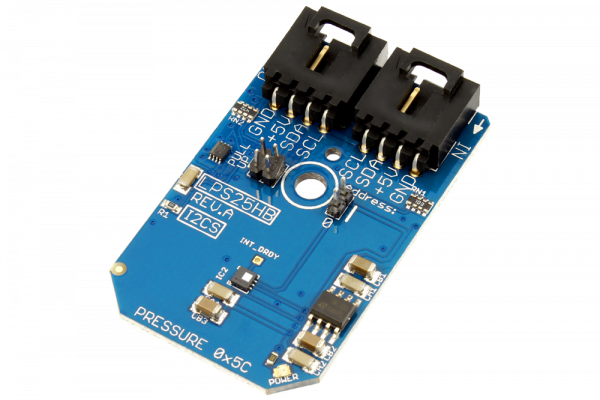

[](https://store.ncd.io/product/lps25hb-mems-pressure-sensor-260-1260-hpa-absolute-digital-output-barometer-i2c-mini-module/).

# LPS25HB

The LPS25HB, manufactured by STMicroelectronics, is absolute pressure sensor which functions as a digital output barometer. It is guaranteed to operate over a temperature range of -30 to +105 °C. This device comprises a sensing element and an IC interface which communicates through I2C from the sensing element to the application. Possible application include enhanced GPS, weather station equipment, etc.
This Device is available from www.ncd.io

[SKU: LPS25HB]

(https://store.ncd.io/product/lps25hb-mems-pressure-sensor-260-1260-hpa-absolute-digital-output-barometer-i2c-mini-module/)
This Sample code can be used with Raspberry Pi.

Hardware needed to interface LPS25HB pressure sensor With Raspberry Pi :

1. <a href="https://store.ncd.io/product/lps25hb-mems-pressure-sensor-260-1260-hpa-absolute-digital-output-barometer-i2c-mini-module/">LPS25HB pressure sensor</a>

2. <a href="https://store.ncd.io/product/i2c-shield-for-raspberry-pi-3-pi2-with-outward-facing-i2c-port-terminates-over-hdmi-port/">Raspberry Pi I2C Shield</a>

3. <a href="https://store.ncd.io/product/i%C2%B2c-cable/">I2C Cable</a>

## Python

Download and install smbus library on Raspberry pi. Steps to install smbus are provided at:

https://pypi.python.org/pypi/smbus-cffi/0.5.1

Download (or git pull) the code in pi. Run the program.

```cpp
$> python LPS25HB.py
```
The lib is a sample library, you will need to calibrate the sensor according to your application requirement.
